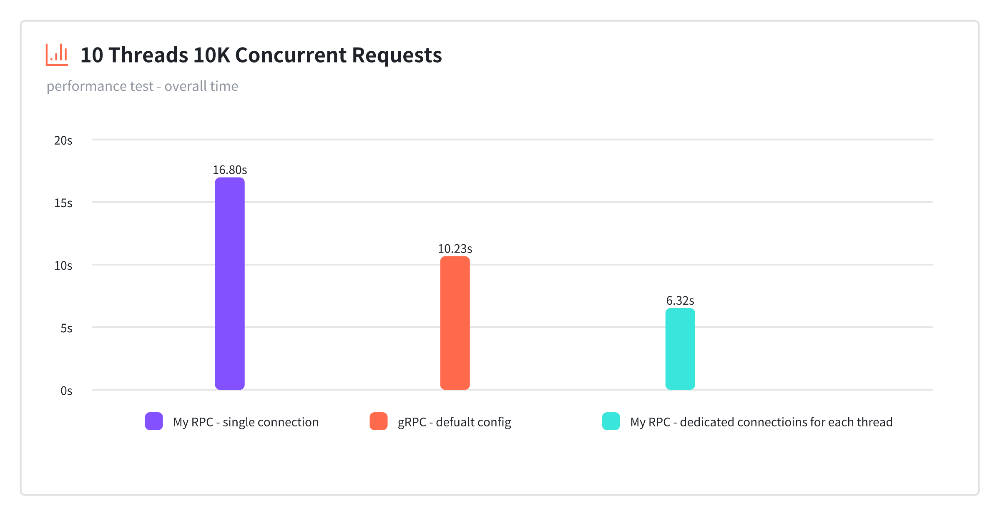

# YPP-RPC
[](https://search.maven.org/artifact/io.github.paopaoyue/ypp-rpc) </br>
YPP-RPC is a lightweight RPC framework based on Springboot implemented with native Java socket interface.

## Features

- Support synchronous remote calls
- Springboot integration
- Microservices friendly
- Use Protobuf encoding
- Persistent connection and more connection control
- Timeout and retry mechanism
- Error handling
- Graceful Termination
- Easy mock Test
- Gradle plugin code generation

## Quick Start

> Your can find the example under `examples/demo` directory.

### Prerequisites

| application            | required version |
|------------------------|------------------|
| JDK                    | 21 or later      |
| Gradle(Gradle wrapper) | 8.6 or later     |
| protoc                 | 26.0 or later    |

1. Create a new Springboot project
You can create a new Springboot project by using the [Spring Initializr](https://start.spring.io/).
<b> Note: Springboot version should be 3.3.0 or later, java version should be 21 or later. </b>
2. Add the following to the <b>TOP</b> of your `gradle.settings` file:
```groovy
pluginManagement {
    repositories {
        gradlePluginPortal()
        mavenCentral()
    }
}
```
3. Add the following to your `build.gradle` file:
```groovy
plugins {
    id 'io.github.paopaoyue.ypp-rpc-generator' version '0.0.3'
}

rpcGenerator {
    serviceName = 'demo-service'
    serviceShortAlias = 'demo' // optional - default to serviceName
    protoRepoPath = 'idl' // optional - default to 'idl' directory from the project root
}
```

4. Run `gradlew generateIdl` to generate the idl files and modify the idl files to define your service.
5. Run `gradlew generateRpc` to generate the rpc files
6. Configure the service endpoints in your `application.properties file:
```properties
mesh.rpc.server-enabled=true
mesh.rpc.server-service.name=demo-service
mesh.rpc.server-service.host=localhost
mesh.rpc.server-service.port=8080

mesh.rpc.client-enabled=true
mesh.rpc.client-services[0].name=demo-service
mesh.rpc.client-services[0].host=localhost
mesh.rpc.client-services[0].port=8080
```
7. Modify the generated `RpcService` class to implement your service logic.
```Java
    @RpcService(serviceName = "demo-service")
    public class DemoService implements IDemoService {
    
        @Override
        public DemoProto.EchoResponse echo(DemoProto.EchoRequest request) {
             return DemoProto.EchoResponse.newBuilder().setText(request.getText()).build();
        }
    }
```
8. Run your Springboot application with `gradlew bootRun` and you are ready to go!
```Java
    @Component
    public static class DemoRunner {

        @Autowired
        private IDemoCaller demoCaller;

        public void run() {
            var response = demoCaller.echo(DemoProto.EchoRequest.newBuilder().setText("hello world").build(), new CallOption());
            System.out.println(response.getText()); // should print "hello world"
        }
    }
```

## Roadmap

- [X] Basic RPC framework
- [X] Gradle plugin for code generation
- [ ] Sidecar for service discovery & load balancing in Kubernetes

## Benchmark
The benchmark is done by running the same service echo logic on ypp-rpc and grpc with 10 concurrent threads and each sends 10k requests.
